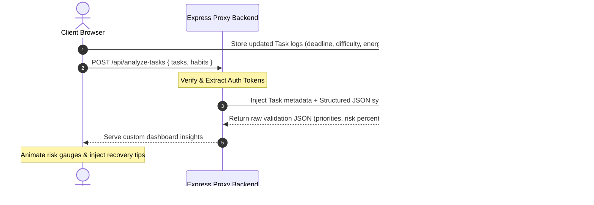
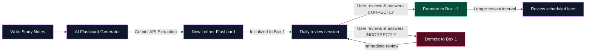

# DeadlineAI: Intelligent AI Productivity Ecosystem

DeadlineAI is a next-generation, context-aware productivity and cognitive learning platform designed to help students, professionals, and creators conquer their backlogs, organize their daily routines, and retain knowledge effectively without falling victim to cognitive burnout. 

By pairing **Google Gemini LLM intelligence** with **Google Firebase** and a full-stack **React + Express** architecture, DeadlineAI bridges the gap between static task tracking and real-time behavioral guidance.

---

## 🚀 Problem Statement Selected

Traditional productivity utilities (to-do lists, calendars, study tools) operate under severe design limitations:
1. **Static Task Management**: Users manually categorize tasks and assign arbitrary priorities, often leading to poor scheduling, delayed actions, and missed deadlines.
2. **Ignored Deadline Volatility**: Standard task managers do not analyze risk factors (difficulty, energy levels, estimated duration) to warn users *before* a deadline becomes unrecoverable.
3. **Rigid Schedule Structures**: Daily planners break down completely when a user falls behind on a single milestone, offering no dynamic, fatigue-aware rescheduling or fallback plans.
4. **Disjointed Ecosystems**: Users are forced to hop between different platforms for tasks, spaced repetition flashcards, Pomodoro timers, habit tracking, water intake, and performance analytics.
5. **Client-Side API Key Exposure**: Many prototype AI applications expose sensitive credentials (like Gemini API Keys) directly in the browser, making them vulnerable to client-side data leaks.

---

## 💡 Solution Overview

DeadlineAI solves these issues by establishing an integrated, full-stack cognitive ecosystem:
- **Server-Side API Proxy (Secure Gateway)**: A secure Node/Express backend isolates the `GEMINI_API_KEY`, routing contextually-dense prompts and raw JSON schemas back and forth securely.
- **AI Task Risk Engine**: Evaluates task parameters to dynamically assign critical priority levels and computes precise risk percentages, complete with diagnostic "reasons" and "recovery action plans."
- **Adaptive Timeline roadmapper**: Synthesizes custom daily schedules mapping work blocks, active breaks, and habits. Includes an **"Adaptive Replanning Blueprint"** that recalculates scheduling structures if a deadline is missed.
- **Integrated Spaced Repetition (Leitner System)**: Allows users to input topics and content, automatically extracts cards via the Gemini API, and updates their retrieval intervals based on box levels.
- **Hybrid Storage Synchronizer**: A fail-proof data engine that operates offline-first using LocalStorage caches, and seamlessly merges data collections with Google Cloud's Firebase Firestore database upon authentication.

---

## 🎨 System Architecture & Workflows

### 1. High-Level Full-Stack System Architecture
The following diagram showcases how the client React application communicates with the secure Express API layer and Google Cloud platforms (Gemini API & Firebase).

```mermaid
graph TD
    %% Define Styles
    classDef client fill:#0d1117,stroke:#38bdf8,stroke-width:2px,color:#fff;
    classDef server fill:#0d1117,stroke:#c084fc,stroke-width:2px,color:#fff;
    classDef google fill:#0d1117,stroke:#f59e0b,stroke-width:2px,color:#fff;
    classDef db fill:#0d1117,stroke:#10b981,stroke-width:2px,color:#fff;

    %% Nodes
    subgraph Client_Tier [Client Presentation React 19]
        A[Interactive SPA UI]:::client
        B[LocalState & Offline Cache]:::client
    end

    subgraph Service_Tier [Application API Express Backend]
        C[Secure API Router]:::server
        D[Vite Dev Server / Static Assets]:::server
    end

    subgraph Firebase_Cloud [Google Firebase Platforms]
        E[Firebase Authentication]:::db
        F[Cloud Firestore database]:::db
    end

    subgraph Gemini_Cloud [Google Gemini AI Platforms]
        G[Gemini 2.5 Flash Engine]:::google
        H[@google/genai SDK]:::google
    end

    %% Flows
    A <-->|Dual-Sync Data| B
    A -->|User Sign-In / OAuth| E
    B <-->|Durable Storage Sync| F
    A -->|Secured API Proxies| C
    C <-->|MIME: application/json| H
    H <-->|Context Queries| G
```

---

### 2. Task Risk Evaluation & Prioritization Workflow
How task backlogs are dynamically evaluated and checked for scheduling feasibility:



---

### 3. Study Flashcards Leitner Workflow
How the system handles note-taking, AI spaced repetition card generation, and retrieval loops:



---

## ⭐ Key Features

### 1. Gamified XP & Level Progression
*   **XP Rewards**: Earn experience points (XP) for finishing tasks, reviewing Leitner decks, and logging water glasses.
*   **Level Ups**: Levelling up awards descriptive badges (e.g., *Early Bird*, *Pomodoro Pro*, *Deadline Conqueror*).
*   **Visual Badges**: Celebrated in a high-contrast visual display on the profile dashboard.

### 2. Task Prioritization & Dynamic Risk Analytics
*   **AI Assessment**: A bespoke algorithm evaluates urgency, difficulty, and duration parameters via `/api/analyze-tasks`.
*   **Risk Percentage Gauge**: Renders dynamic, responsive color dials indicating the danger of missing a deadline.
*   **Action Remediation**: Renders step-by-step custom recovery steps directly under warning banners.

### 3. Adaptive Schedule Timeline & Fallback Replanner
*   **Hourly Schedule Roadmapper**: Schedules tasks, focus pomodoros, and healthy habits dynamically across your waking hours.
*   **"Couldn't Finish Task?" Replanner Widget**: Select a task you fell behind on, and the AI coach automatically recalculates scheduling intensity, shifts rest blocks, and buffers downstream deadlines.

### 4. Spaced Repetition (Leitner System) with AI Extraction
*   **Workspace Notebook**: Write or paste summaries directly inside the Study Notepad.
*   **AI Auto-Flashcard Extractor**: Instantly extracts relevant conceptual questions and detailed flipped answers.
*   **3D Flipping Deck**: Fully interactive cards designed to simulate actual cardboard cards.

### 5. Study Ambiance & Pomodoro Timer
*   **Interactive Timer**: Transition effortlessly between focus blocks and rest intervals.
*   **Audio Synthesizer**: Fully interactive rainfall, cafe buzz, and white noise generators built utilizing browser audio loop controls.

### 6. Habit Loop Matrix & Hydration Tracker
*   **Consistency Tracking**: Check habits off daily and build visual streak counters.
*   **Hydration Tracker**: Beautifully animated liquid glass filling dynamically as water logs are committed.

### 7. AI Executive report Cards
*   **Report Generation**: Analyze weekly focus metrics and retrieve overall grades (0-100).
*   **Detailed Diagnostics**: Displays core strengths, key bottlenecks, and action blueprints.

### 8. Full-Context Chat Coach Sandbox
*   **Synchronized Queries**: The chat box automatically feeds your entire live task list, habits, and goals to the LLM backend context, giving you a coach that knows *exactly* what you need.

---

## 🛠️ Technologies Used

### Frontend Presentation
*   **React 19 & React Router 7**: Core SPA runtime.
*   **Vite 6**: Project bundling and asset compilation.
*   **Tailwind CSS v4**: Utility-first styling with modern CSS custom variables.
*   **Framer Motion / Motion React**: Fluid UI transitions, micro-interactions, modal fade-ins, and floating card triggers.
*   **Recharts**: Interactive performance graphs (area and bar distributions) with responsive containers.
*   **Lucide React**: Clean vector-icon interfaces.

### Backend Systems
*   **Node.js & TypeScript**: Type-safe development.
*   **Express**: REST routing and secure API endpoint wrappers.
*   **Esbuild**: Bundles the TypeScript backend server into a production-ready standalone CommonJS bundle (`dist/server.cjs`).
*   **Tsx**: Immediate TypeScript execution during local dev cycles.

---

## 🌟 Google Technologies Utilized

### 1. Google Gemini API (`@google/genai`)
DeadlineAI relies heavily on the official, modern Google Gen AI SDK (`@google/genai`) to power its intelligent backend features.
*   **Model Selection**: Utilizes the high-speed and context-efficient `gemini-2.5-flash` model for all operational endpoints, optimizing cost and response latency.
*   **Strict JSON Outlining**: Configured with `responseMimeType: "application/json"` to ensure that Gemini responds only with valid, parsable JSON data matching the platform’s structural schemas.
*   **Context Injection Pattern**: Injects real-time user database collections (Tasks, Habits, Goals) inside the prompt headers to provide bespoke, highly localized suggestions.

### 2. Google Firebase (Authentication & Cloud Firestore)
The database engine runs on a seamless integration with Google's Firebase services:
*   **Firebase Authentication**: Secures login states using email/password authentication or anonymous session tokens.
*   **Cloud Firestore Database**: Uses highly structured document collections (`users`, `tasks`, `habits`, `goals`, `flashcards`, `notifications`) for low-latency synchronization and persistent storage.
*   **Cache Merging Layer**: Merges client-side offline states with server-side database instances upon successful login.

---

## 🔧 Environment Variables

Before running the application, define these environment variables inside your environment:

```env
# .env.example
# Your private, server-side Gemini API Key (keep hidden from frontend)
GEMINI_API_KEY=your_gemini_api_key_here

# Firebase Web Configuration parameters (Safe for public client injection)
VITE_FIREBASE_API_KEY=your_firebase_api_key
VITE_FIREBASE_AUTH_DOMAIN=your_firebase_auth_domain
VITE_FIREBASE_PROJECT_ID=your_firebase_project_id
VITE_FIREBASE_STORAGE_BUCKET=your_firebase_storage_bucket
VITE_FIREBASE_MESSAGING_SENDER_ID=your_firebase_messaging_sender_id
VITE_FIREBASE_APP_ID=your_firebase_app_id
```

---

*Formulated with care and optimized for performance inside Cloud Run.*
